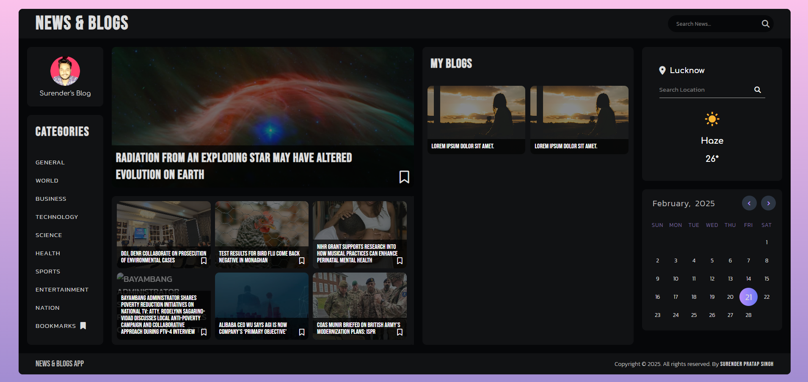

# News & Weather App

## Table of Contents

1. [How to Clone Repo](#how-to-clone-repo)
2. [App Description](#app-description)
    - [Latest News](#latest-news)
    - [News Filter by Category](#news-filter-by-category)
    - [Search News](#search-news)
3. [API Integration](#api-integration)
    - [News API](#news-api)
    - [Weather API](#weather-api)
4. [Weather Functionality](#weather-functionality)
    - [Search Weather](#search-weather)
    - [Location-Based Weather](#location-based-weather)
5. [Calendar Functionality](#calendar-functionality)
6. [Screenshots](#screenshots)

---

## 1. How to Clone Repo

To clone this repository, follow these steps:

1. Open your terminal or command prompt.
2. Type the following command:
    ```bash
    git clone https://github.com/yourusername/repo-name.git
    ```
3. Screenshots of app

### Home Screen



### Blog creation Screen


